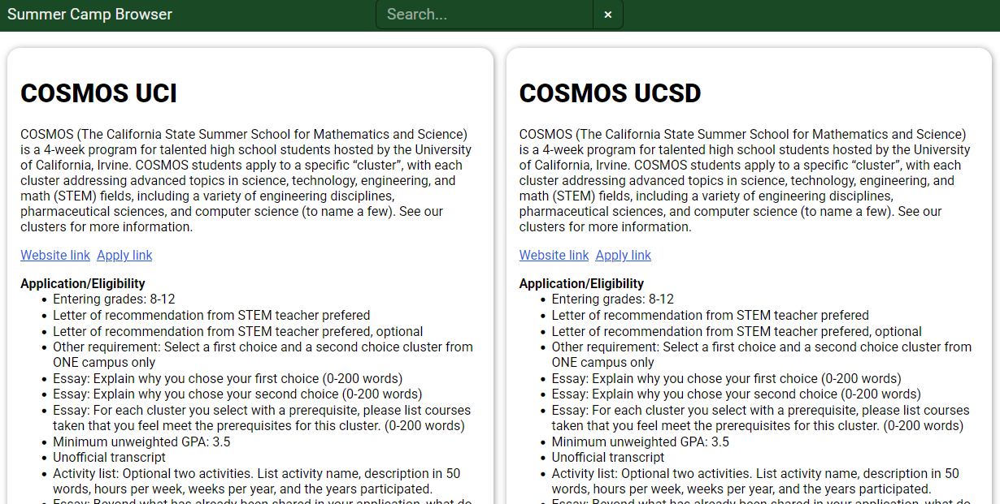

# Summer Camp Browser

Built to help my students discover and apply to high school summer camps, Summer Camp Browser shows all the requirements and descriptions in a unified interface.

## Interface
Summer Camp Browser shows precise application requirements and track descriptions for each program. Programs can be filtered with the search bar above. Collapsible track descriptions save space and allow deeper exploration.

## Building

Build with `trunk build --release` and change the paths in `dist/index.html` to have those of the GitHub Pages base url.